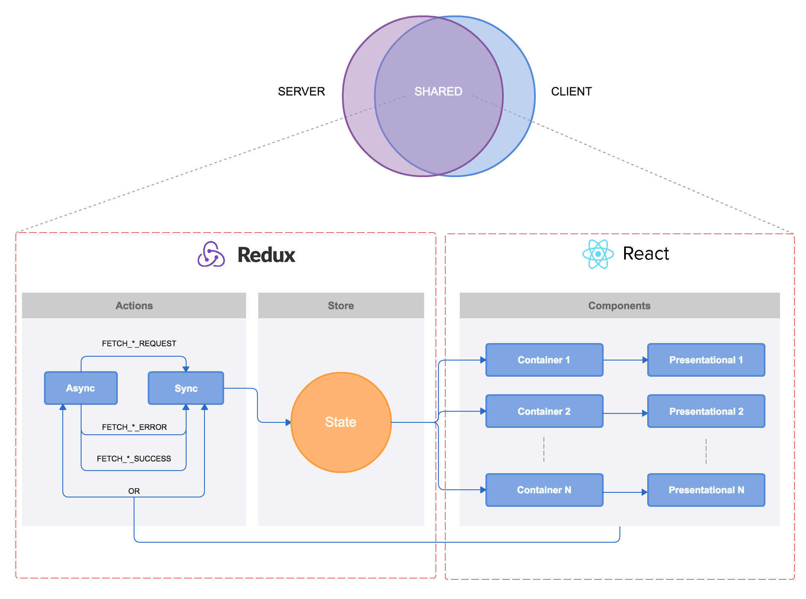

# Boggle JS [](https://travis-ci.org/lquixada/boggle)

A web-based implementation of the Boggle game for study purposes. More info on https://en.wikipedia.org/wiki/Boggle.


## Installation

```
$ git clone https://github.com/lquixada/boggle.git
$ cd boggle
$ npm install
$ curl -o- https://raw.githubusercontent.com/creationix/nvm/v0.32.0/install.sh | bash
$ nvm install
$ nvm use
```


## Getting Started

To run the app in development mode, run:

```
$ npm run start:dev
```

And go to http://localhost:9000/.

In order to run in production mode, run:

```
$ npm start
```

And go to http://localhost:9000/.

> Note that in dev mode bundle.js will be served from memory whereas
> in prod mode it will be served from disk.

To run all tests and lints, run:

```
$ npm test
```


## Features

* Cross-browser (latest Firefox/Chrome and IE10)
* Cross-device (from mobile to desktop)
* Isomorphic, renders on server and client
* Secure connection with HTTPS
* Custom domain: www.bogglejs.com
* Cache management with Service Worker


## Pages

* **/**: that's where the game is.
* **/about**: a little about my professional thinking (it can be also accessed throught the footer link)


## Architecture




## Tasks

* **npm test**: runs all tests and lints
* **npm run jest**: tests files
* **npm run lint**: lints files
* **npm start**: shortcut for *npm run start:prod*
* **npm run start:dev**: starts application in development mode
* **npm run start:prod**: starts application in production mode
* **npm run build**: builds all production assets
* **npm run deploy**: deploys project to Heroku


## Stack

* **App**: react, redux, immutable.js
* **Style**: sass
* **Tests**: jest
* **Lint**: eslint, sass-lint
* **Utils**: npm, webpack, babel
* **CI**: [TravisCI](https://travis-ci.org/lquixada/boggle)
* **Hosting**: [Heroku](https://bogglejs.herokuapp.com/)
* **SSL**: [Let's Encrypt](https://letsencrypt.org/)

